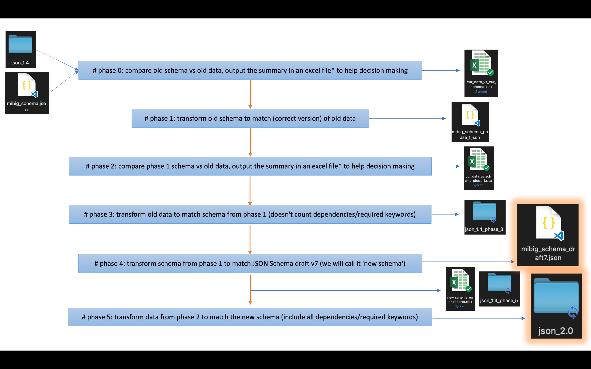

# mibig_14_to_20_schema_refactoring
This collection of scripts, JSONs and excel files are used to document the migration process of MIBiG schema and dataset from 1.4 to 2.0

Refactor MIBiG (version 1.4: August 6th, 2018) JSON schema, both structurally and conceptually.
Adopt the latest JSON schema (Draft V7), and update existing data to match the new schema.

